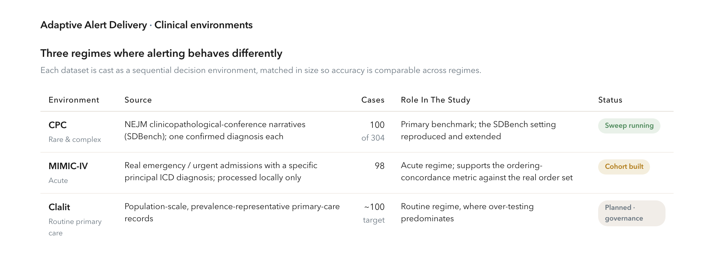
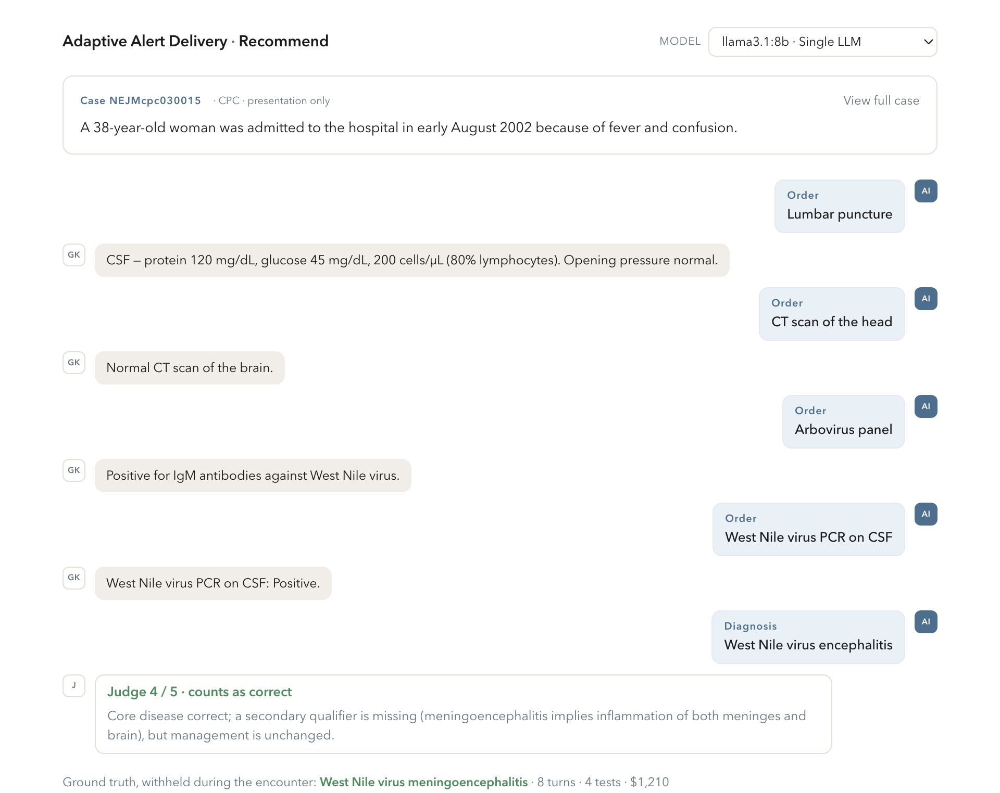
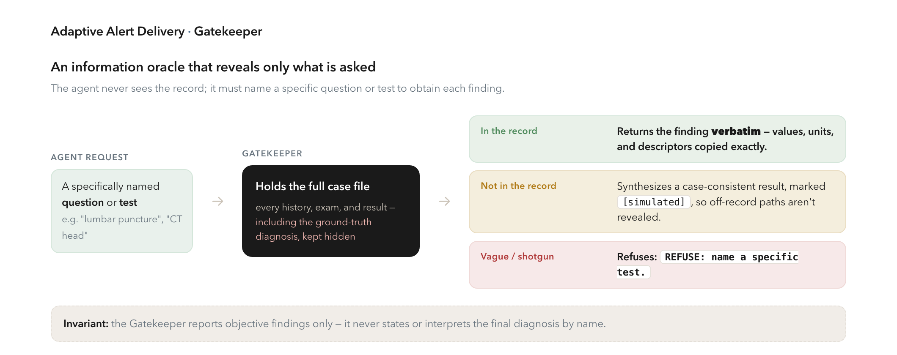
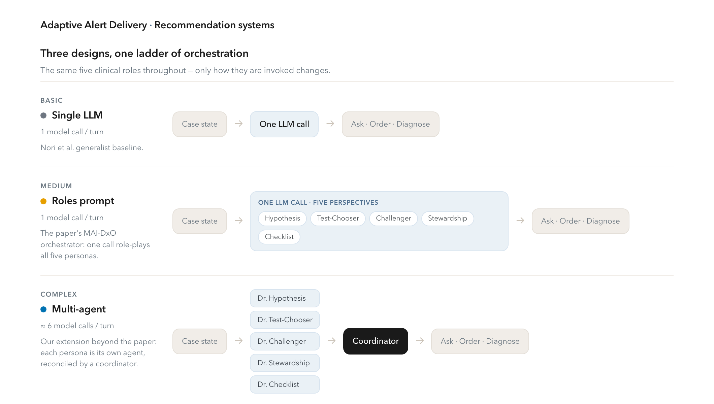
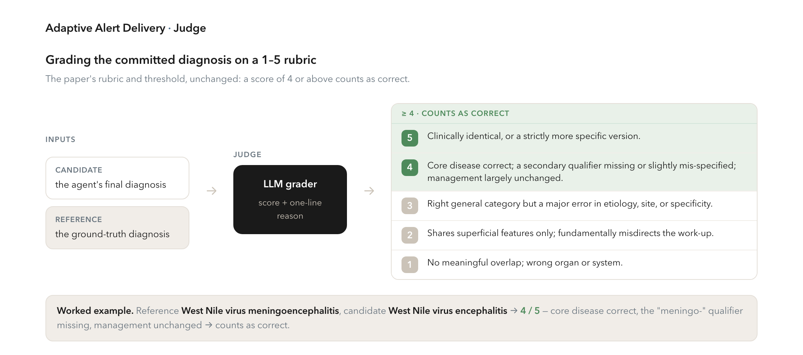
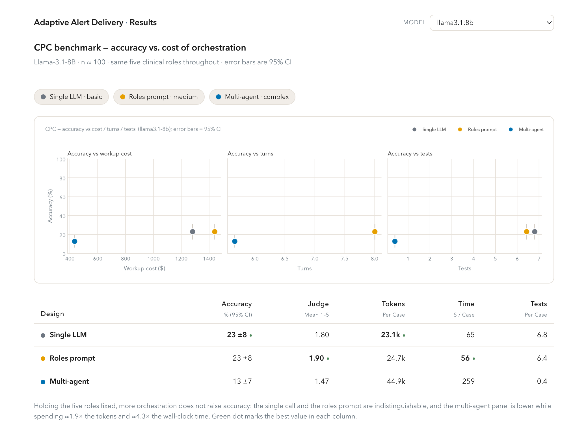
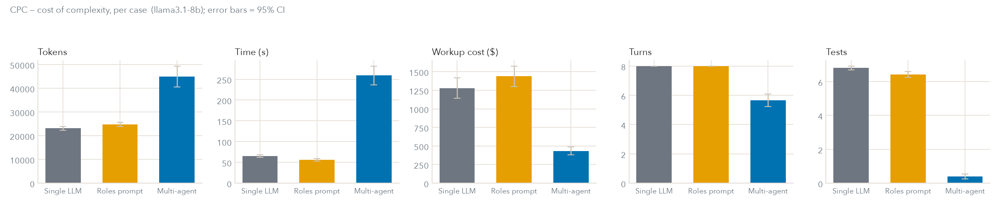

# Adaptive Delivery of LLM-Generated Diagnostic Test Recommendations

**Progress report · 2026-07-07 · Aashna Shah**

## Abstract

Large language models now perform sequential diagnostic reasoning at expert level, yet the evidence
suggests that their clinical value is limited less by diagnostic capability than by how recommendations
are delivered to, and acted upon by, clinicians. This project studies that delivery problem. As a
foundation, we have built an open, reproducible harness that reproduces and extends the sequential
test-ordering benchmark of Nori et al. (2025). This report describes the completed generation pipeline —
datasets, case presentation, the information Gatekeeper, three recommendation systems, an automated Judge,
and the evaluation metrics — presents preliminary results, and sets out the plan. Comparing three
recommender designs of increasing orchestration complexity, we find on an open 8B model that added
orchestration does not improve diagnostic accuracy: a single prompt reasoning through the paper's five
roles matches a plain single call, and splitting those roles across separate agents does not beat either
while costing roughly twice the tokens and four times the wall-clock time. Across the full 100-case CPC set
the two single-call designs are statistically indistinguishable, and the multi-agent panel is the weakest
of the three. The immediate objective
is to match the benchmark's headline accuracy (approximately 80%) using frontier models on our harness;
the longer-term objective is an adaptive delivery layer that presents recommendations in a
context-appropriate way to increase clinician uptake without increasing alert burden.

---

## At a glance

**Goals.** *Immediate:* reproduce the benchmark's headline accuracy (~80%) with a frontier model on our
open, reproducible harness. *Longer-term:* an adaptive delivery layer that raises appropriate clinician
uptake without adding alert burden.

**Where we are.** The generation pipeline is complete and validated end to end. The full 100-case CPC
design comparison is done on an open 8B model (Llama-3.1-8B): the single call and the roles prompt are
statistically indistinguishable (both 23%), and the multi-agent panel is the weakest (13%) at ~1.9× the
compute — added orchestration does not buy accuracy on this model. Larger models, the MIMIC-IV
concordance sweep, and the delivery layer are next.

**Timeline and venues.**

| Period | Milestone | Target venue |
|---|---|---|
| Q1 · Sep '26 | Benchmark and EHR environments | NeurIPS workshop (GenAI4Health), non-archival |
| Q2 · Nov '26 | Recommender and scoring | AAAI Health Intelligence (W3PHIAI), non-archival |
| Q3 · Jan '27 | Delivery-interface co-design | CHI, non-archival |
| Q3 · Jan '27 | Adaptive delivery policy | ICML, archival |
| Q4 · May '27 | Full system with clinical results | NeurIPS, archival |

**Intended contributions.** The first study of the *delivery* of language-model clinical recommendations;
new sequential test-ordering environments built from real EHR data and reusable by others; and a
safety-grounded, multi-objective alerting layer reproducible on public data.

---

## 1. Introduction

### 1.1 Motivation

Reasoning-capable language models now match or exceed physicians on diagnostic tasks (Brodeur 2026;
Kanjee 2023; Nori 2025) and show strong differential-diagnosis performance (McDuff 2025; Tu 2025).
Diagnostic capability, in other words, is no longer the primary constraint. The constraint is delivery.
In a randomized clinical trial, Goh et al. (2024) found that although a language model on its own
outperformed physicians, physicians *given access to* the model did not improve relative to those without
it. The capability was available and went unused. This reflects a well-documented failure mode of clinical
decision support: recommendations delivered as indiscriminate, interruptive alerts produce alert fatigue,
after which clinicians override or disable them (AHRQ 2019; Baron 2021; Park 2022). A system that is
diagnostically excellent but poorly delivered therefore captures little clinical value.

### 1.2 Prior work and its limitations

The most relevant prior work is Nori et al. (2025), which converts NEJM clinicopathological-conference
(CPC) cases into interactive sequential encounters (the Sequential Diagnosis Benchmark, SDBench) and
introduces MAI-DxO, an orchestrator that role-plays a panel of physicians. On the o3 model, MAI-DxO
reaches approximately 80% diagnostic accuracy, against approximately 20% for generalist physicians, at
lower cumulative test cost. It is a strong foundation, but it has four limitations for the question of
clinical impact, which this project is designed to address.

| Limitation of Nori et al. (2025) | How this project addresses it |
|---|---|
| The benchmark ends when a diagnosis is produced; it does not model whether the recommendation is delivered or acted upon, which the Goh (2024) trial identifies as the decisive step. | Adds a scoring, delivery, clinician-response, and evaluation layer downstream of generation. |
| Evaluation is confined to rare, difficulty-selected CPC cases, a single clinical regime. | Casts three clinical regimes as environments: CPC (rare), MIMIC-IV (acute), and Clalit (routine care). |
| The objective is the Triple Aim (care, health, cost), which omits clinician workload and experience — the very factors that alerting mismanages. | Introduces clinician workload and patient experience through the delivery layer (Section 4), which weighs uptake against alert burden; extending the recommender itself to these aims is left to future work. |
| Results depend on a closed frontier model, limiting reproducibility. | Runs on open models and public data throughout. |

### 1.3 Research question and system overview

The research question is whether adaptive, context-aware delivery of language-model-generated diagnostic
test recommendations can increase appropriate clinician uptake without increasing alerting burden. The
guiding observation is that appropriateness alone is insufficient: alert compliance varies with context,
prior results, the encounter, and the individual clinician (Baron 2021), so the same recommendation should
be delivered differently in a busy emergency department than in a low-load clinic. The question is
therefore not only whether a recommendation is appropriate, but how it should be presented given the
context.

The full system comprises five stages:

1. **Recommend.** A recommender works the case sequentially and proposes diagnostic tests; three designs
   of increasing orchestration complexity are compared (Section 2.4).
2. **Score.** Each proposed recommendation is scored for appropriateness and potential harm.
3. **Deliver.** The recommendation is surfaced to the clinician through a presentation action chosen for
   the context, ranging from an interruptive alert to passive display or suppression.
4. **Record.** The clinician's response — accept, dismiss, or defer — is captured.
5. **Evaluate.** Outcomes are measured on diagnostic accuracy, cost, and appropriate uptake.

Stages 1, 2, and 5 (as they apply to the recommendation itself) are implemented and are the subject of
this report; stages 3 and 4 are the project's forward-looking contribution and are outlined in Section 4.

---

## 2. Methods

The generation pipeline reproduces the SDBench/MAI-DxO harness of Nori et al. (2025) and adapts it as
described in Section 1.2. The subsections below follow the pipeline in order. System prompts are
reproduced in Appendix A.

### 2.1 Clinical vignettes

Each dataset is cast as a sequential decision environment in which an agent works a case turn by turn.
The three environments are chosen to span the clinical regimes in which alerting behaves differently
(Figure 1).



*Figure 1. The three clinical environments, matched in size so accuracy is comparable across regimes.*

*CPC (rare and complex).* NEJM clinicopathological-conference narratives, the SDBench setting: long,
deliberately difficult cases, each with a single confirmed diagnosis. The benchmark comprises 304 cases;
we use a 100-case subset, for two reasons. First, at n = 100 accuracy is estimated to within roughly
±6–7 percentage points at 95% confidence, which is sufficient to separate designs that differ by more than
about ten points while bounding the compute cost of a full model-by-design sweep. Second, it matches the
size of the MIMIC-IV cohort below, so accuracy is comparable across regimes. Extending to the full 304
cases with the benchmark's held-out split is planned.

*MIMIC-IV (acute).* Ninety-eight real MIMIC-IV admissions, constructed by a fixed protocol to mirror the
CPC set in size while representing the acute regime. Cases are drawn from emergency or urgent admissions
whose principal ICD diagnosis is specific — codes containing "unspecified", "other", or "not elsewhere" are
excluded so that the ground truth is gradeable — and whose stay records between 12 and 40 laboratory
results, enough to support a non-trivial sequential work-up without being unwieldy. Scanning 260 candidate
admissions under these criteria and targeting 100 yielded 98. The presentation is the intake demographics
and admission context, the recorded chart itself serves as the Gatekeeper, and the real order set supports
the ordering-concordance metric. Because these are credentialed patient data, they are processed only on
the local environment and are never sent to hosted models. Running the full sweep on this cohort is in
progress.

*Clalit (routine primary care).* Population-scale primary-care records, which are prevalence-representative
and the setting in which over-testing predominantly occurs. The cohort will be constructed to the same
target size and with an analogous specificity-and-workup filter, so that all three regimes are comparable.
Integration is planned and depends on Clalit's data-governance process.

### 2.2 Case presentation

Every encounter opens with a short abstract, while the full record remains hidden behind the Gatekeeper
(Section 2.3). In CPC case `NEJM200003303421308`, for example, the agent initially observes only the
presenting line ("A 63-year-old man was admitted in early July because of rapidly progressive changes in
behavior and ataxia"), while the ground-truth diagnosis (cerebral amyloid angiopathy with giant-cell
inflammatory reaction) is withheld. At each step the running state is presented as the abstract, followed
by any revealed history and examination findings, each ordered test with its returned result, and a
cumulative cost. Each question, order, or diagnosis constitutes one turn, and orders are batched to at most
three tests per round, following MAI-DxO. Episodes run to a maximum of eight turns; if the agent has not
committed by then, a diagnosis is forced so that every episode ends with a scored verdict.



*Figure 2. An example encounter as replayed in the application. The agent (right) sees only the
presentation, orders tests one turn at a time, and the Gatekeeper (left) returns each finding; the Judge
grades the committed diagnosis against the withheld ground truth. Shown for CPC case NEJMcpc030015
(Llama-3.1-8B, single-LLM design).*

### 2.3 The Gatekeeper

The Gatekeeper is an information oracle that holds the complete case file, including the ground-truth
diagnosis, and reveals a finding only in response to a specifically named question or test (Figure 3).
Vague requests are refused; for any item not present in the record, it synthesizes a case-consistent
result so that an "unavailable" response never reveals which diagnostic paths lie off the record. It is
implemented in two
forms: a rule-based lookup returning exact stored values for structured EHR cases, and a language-model
backend, run with reasoning disabled, for the free-text CPC narratives. This follows the design of
Nori et al. — synthesize rather than refuse, and never reveal diagnostic hints. The principal difference
is validation: they employ a dedicated o4-mini Gatekeeper validated by physicians on 508 responses,
whereas in our current runs the Gatekeeper shares the agent's model and has not yet been physician-validated.



*Figure 3. The Gatekeeper answers a specifically named question or test — verbatim when the finding is in
the record, a case-consistent `[simulated]` value when it is not, and a refusal for vague requests — while
never revealing the diagnosis.*

### 2.4 Recommendation systems

The recommendation system is the agent that works the case. We evaluate three designs that form a ladder
of increasing orchestration complexity — basic, medium, and complex — holding the underlying clinical
reasoning fixed so that the comparison isolates the effect of orchestration rather than confounding it
with a change of roles. All three ultimately draw on the same five clinical roles (the MAI-DxO personas of
Nori et al.); they differ only in how those roles are invoked. The question this ladder is built to answer
is not whether more machinery *can* help but whether it is *warranted*: whether progressively more
orchestration buys accuracy that a simpler design does not already deliver, and at what compute cost
(Figure 4).



*Figure 4. The three recommender designs. The same five MAI-DxO roles run throughout; only the
orchestration changes — one call (basic), one call reasoning through all five roles (medium, the paper's
MAI-DxO orchestrator), and five separate agents reconciled by a coordinator (complex, our extension), which
costs roughly six model calls per turn against one.*

*Single LLM (basic).* A single model call that emits one action per turn, directed to reason from the
presentation, form a differential, order the most discriminating test, and ultimately name a specific
diagnosis. This is the plain generalist baseline of Nori et al., with no explicit panel.

*Roles prompt (medium).* A single call that reasons through the five MAI-DxO perspectives together before
acting: Hypothesis (a probability-ranked differential), Test-Chooser (the most discriminating test),
Challenger (evidence that would falsify the leading diagnosis), Stewardship (cost), and Checklist (a
validity check). This is the paper's MAI-DxO orchestrator as it is actually implemented: Nori et al.'s
orchestrator is itself a single language model role-playing the five personas within one call. This design
is therefore not an approximation of MAI-DxO but our direct rendition of it.

*Multi-agent panel (complex).* Our extension beyond the paper. The same five personas are split into five
*independent* model calls — one per persona — whose proposals a sixth coordinator call reconciles into one
action. Where the paper's orchestrator role-plays the panel inside a single call, this design makes the
panel genuinely multi-agent, at roughly five to six model calls per turn against the single call of the
other two. Because the roles are held fixed across all three designs, the basic, medium, and complex
variants form a controlled ladder that separates the cost of orchestration (Section 3.2) from any accuracy
it provides (Section 3.1), and in particular tests whether going beyond the paper's single-call
orchestrator to a true multi-agent panel is warranted.

### 2.5 The Judge

The Judge scores the agent's final diagnosis against the ground truth on the benchmark's five-point rubric,
which grades the core entity, etiology, site, specificity, and completeness; a score of 4 or above is
counted as correct (Figure 5). It is implemented as a language-model grader returning a score and a one-line
justification, with a keyword-matching fallback. We adopt the rubric and threshold of Nori et al.
unchanged. The difference, again, is grader strength and validation: they use o3 as Judge, validated
against physicians at Cohen's κ = 0.70–0.87, whereas we currently run the Judge on the agent's own model
and have not yet validated it. Moving the Judge to a fixed, strong model is a near-term priority.



*Figure 5. The Judge grades the candidate against the reference diagnosis on the paper's 1–5 rubric; a
score of 4 or above counts as correct. The worked example is the West Nile encounter of Figure 2.*

### 2.6 Evaluation metrics

We distinguish metrics the harness computes automatically from those that require a clinician grader.

*Diagnostic quality.* Accuracy is the proportion of cases scored 4 or above by the Judge; the mean Judge
score on the 1–5 rubric is reported as a finer-grained signal. Because the CPC cases span specialties,
accuracy can additionally be reported per specialty once the sweep provides sufficient cases per specialty.

*Cost, effort, and compute.* Each accuracy figure is paired with the effort required to obtain it. Dollar
cost combines a fixed physician-visit fee of \$300, charged once per burst of questions before a test, with
a per-test price drawn from the schedule below. Interaction length (turns, tests, and questions) proxies
clinician effort, and compute (tokens, reasoning tokens where exposed, and latency) determines
local-versus-hosted feasibility.

| Test category | USD | Test category | USD |
|---|---|---|---|
| PET / PET-CT | 1500 | Lumbar puncture / CSF | 300 |
| Endoscopy / bronchoscopy / colonoscopy | 800 | Echocardiography / ultrasound | 200 |
| MRI | 600 | Serology / antibody / titer | 100 |
| Biopsy / bone marrow | 600 | Culture / Gram stain | 80 |
| Angiography / CTA | 500 | Basic labs (CBC, CMP, ESR, CRP) | 30 |
| Flow cytometry / genetic / PCR | 400 | Radiography / mammography | 50 |
| CT | 300 | Unmatched (default) | 100 |

The visit fee and question-burst rule are identical to Nori et al.; the test pricing differs, in that they
map each order to CPT codes priced from a 2023 US CMS transparency table, whereas we use the hand-set
schedule above. Our absolute figures are therefore coarser and not CPT-grounded, but because the same
schedule applies to every agent, relative comparisons hold. A CPT-coded lookup is planned.

*Ordering concordance.* On the structured-EHR cases we store the labs actually measured for the real
patient, allowing us to assess whether the agent's work-up concorded with real practice. We report recall
(the proportion of measured labs the agent's orders covered) and precision (the proportion of the agent's
orders corresponding to a measured lab). Matching is performed by a language model so that a panel maps to
its component analytes. This metric applies to MIMIC-IV and Clalit, where a real order set exists.

*Appropriateness and harm.* The appropriateness and potential harm of each recommendation are graded by
clinicians. A deterministic prototype scorer, adapted from the NOHARM rubric (Wu et al. 2025), is
maintained to drive the delivery reward, but the measurement of record is the clinician grade. The
application includes an expert-grading console in which a clinician grades a sampled recommendation while
the prototype score is recorded but hidden, so that the human grade is not biased by it. We then report the
clinician grades and, separately, their agreement with the prototype scorer.

*Ablations and sweeps.* Two harnesses probe the recommendation systems in more depth: a leave-one-out
ablation of the multi-agent panel, which removes one persona at a time to identify which contributes any
gain the panel provides, and a budget sweep, which caps cumulative spend at a series of ceilings to trace
how each design degrades as cost is constrained. Both are implemented; their results are reported in
Section 3.

### 2.7 Software

The pipeline is operable as a web application with one view per stage and a model selector that replays any
recorded model. It records every diagnostic transcript and serves as the substrate for both the automated
benchmark and the planned human study.

---

## 3. Results

The pipeline runs end to end. The numbers below come from the completed Llama-3.1-8B CPC run: the full
100-case set, all three designs. This slice of the sweep is therefore final; larger models (Qwen3-32B
here; 70B and hosted frontier models are pending) are reported where a run has completed. The compute cost
of each design is the most reliable signal, and the accuracy ordering is now supported by the full run.

**Key result.** On the sequential CPC benchmark, added orchestration does not improve diagnostic accuracy
on the 8B model. A single prompt that reasons through the five MAI-DxO roles (medium) matches a plain
single LLM (basic), and splitting those same roles across independent agents (complex) does not beat
either — while costing roughly twice the tokens and four to five times the wall-clock time. On this
evidence the paper's single-call orchestrator captures whatever the roles contribute, and the further step
to a genuine multi-agent panel is not yet warranted. The samples are small and the accuracy intervals wide,
so the robust signal is the compute cost, not the accuracy ordering.

| Quantity | Value |
|---|---|
| Accuracy: single LLM vs. roles prompt (Llama-3.1-8B, n = 100) | 23% vs. 23% |
| Accuracy: multi-agent panel (same slice) | 13% |
| Compute of multi-agent vs. single-call designs (tokens / wall-time) | ≈ 1.9× / ≈ 4.3× |

### 3.1 Main finding: accuracy versus cost and effort

*Method.* Each design works every case through the information Gatekeeper, which reveals a finding only
when the agent asks and at a cost, and the final diagnosis is graded 1–5 by the Judge (4 or above counts as
correct). The three designs form the basic → medium → complex ladder of Section 2.4. Accuracy is plotted
against each of cost, turns, and tests, so that points nearer the upper-left — more accurate, cheaper, or
fewer turns — are preferable; whiskers are 95% confidence intervals (Figure 6).

*Result.* On the full Llama-3.1-8B run (n = 100), the basic single LLM and the medium roles prompt reach
the same accuracy (23% each; mean Judge 1.80 and 1.90), with heavily overlapping confidence intervals, so
they are statistically indistinguishable. The complex multi-agent panel is lower (13%; mean Judge 1.47). The
panel also behaves differently: it commits after about 6 turns rather than the full 8.0 and orders almost
no tests (0.4 per case against roughly 6.5 for the single-call designs), so its low dollar cost reflects
early commitment rather than efficient work-up. The full CPC run is reported in Table 1.

*Interpretation.* On this model no accuracy separates the basic and medium designs, and the complex panel
does not improve on either. Even with the intervals down to about ±8 at n = 100, the two single-call
designs remain indistinguishable, while the multi-agent panel is consistently and clearly lower — so added
orchestration is not buying accuracy here. Whether
a more capable base model changes this is open — the Qwen3-32B rows are a first, small-n look — and is the
reason the sweep continues across models.



*Figure 6. The application's Results view for the CPC benchmark: accuracy versus cost, turns, and tests for
the three designs, with the per-design summary beneath (Llama-3.1-8B, n = 100; whiskers are 95% CIs; the
green dot marks the best value in each column). The panels fill in across models as the sweep proceeds.*

*Table 1. CPC sweep in progress. The Llama-3.1-8B rows are the controlled basic → medium → complex ladder
(same roles throughout); accuracy is shown with its 95% CI. The Qwen3-32B rows are a small-n, larger-model
preview; its multi-agent run and the 70B and hosted models are pending.*

| Model | Design | n | Accuracy | Mean Judge | Cost | Turns | Tests |
|---|---|--:|--:|--:|--:|--:|--:|
| Llama-3.1-8B | Single LLM (basic) | 100 | 23% ±8 | 1.80 | \$1,279 | 8.0 | 6.8 |
| Llama-3.1-8B | Roles prompt (medium) | 100 | 23% ±8 | 1.90 | \$1,438 | 8.0 | 6.4 |
| Llama-3.1-8B | Multi-agent (complex) | 100 | 13% ±7 | 1.47 | \$433 | 5.7 | 0.4 |
| Qwen3-32B | Single LLM (basic) | 5 | 60% | 3.60 | \$1,530 | 4.0 | 6.4 |
| Qwen3-32B | Roles prompt (medium) | 5 | 40% | 3.00 | \$1,340 | 4.0 | 5.4 |

Two patterns are visible even at this sample size. First, holding the roles fixed, moving from one call
(basic, medium) to five separate agents (complex) does not raise accuracy on either model slice; on the 8B
model it lowers it. Second, the small-n Qwen3-32B rows show the base model is the larger lever — the basic
single LLM on the 32B model already reaches 60%, above any 8B design — which is why the sweep continues to
more capable models before drawing firm conclusions.

### 3.2 Cost of complexity: per-case compute and workup

*Method.* For each design we log the LLM tokens, the wall-clock time to a delivered recommendation, the
dollar cost of the tests ordered, the interaction turns, and the number of tests, averaged per case with
95% confidence intervals. The complex multi-agent panel issues roughly five to six LLM calls per turn (one
per persona plus a coordinator), whereas the basic and medium designs issue one.

*Result.* The compute gap is the clearest signal in the data. On Llama-3.1-8B a case costs about 23,100
tokens and 65 seconds under the single LLM and 24,700 tokens and 56 seconds under the roles prompt, but
about 44,900 tokens and 259 seconds under the multi-agent panel — roughly 1.9× the tokens and 4.3× the
wall-clock time of the single-call designs (Figure 7).

*Interpretation.* The multi-agent panel's tokens and latency rise sharply while its accuracy does not, so
on this model the additional machinery is not justified for test recommendation: the single-call roles
prompt delivers comparable accuracy at a fraction of the compute. This profile also determines feasibility —
a single-call design at ~23k tokens per case is far more practical to run locally, or at scale, than a
panel at ~45k tokens and several minutes per case.



*Figure 7. Per-case cost profile across the three designs (Llama-3.1-8B, n = 100; further configurations are
added as the sweep proceeds).*

### 3.3 Evaluation in progress

The remaining evaluation harnesses are implemented and instrumented but not yet informative, because they
have so far run only on the weak 8B model or await credentialed data. Their status is summarized in
Table 2.

*Table 2. Status of the remaining evaluations.*

| Evaluation | Instrument | Status |
|---|---|---|
| Panel ablation (leave-one-out over the five personas) | Implemented; run on 8B | Not yet informative; requires a capable model to separate personas |
| Budget sweep (accuracy under cost ceilings) | Implemented; run on 8B | Accuracy-versus-budget curves pending a capable model |
| Ordering concordance (recall / precision) | Implemented; MIMIC-IV cohort built (98 cases) | Sweep on the MIMIC-IV cohort in progress; Clalit pending |
| Appropriateness and harm | Grading console implemented | Awaits clinician grading |

---

## 4. Discussion and next steps

### 4.1 Finalizing the pipeline: toward 80% accuracy

The immediate objective is to reproduce the benchmark's headline accuracy — approximately 80% with a
frontier model — on our own harness. This requires four steps. First, completing the model sweep: finishing
Qwen3-32B across all three designs, re-running the 70B at full sample size, and adding hosted frontier
models (for example GPT-5, Gemini-2.5-Pro, and Claude-Sonnet-5) as API access permits, which is the direct
test of whether the reported gains reproduce and whether we reach approximately 80%. Second, de-noising the
environment by moving the Judge and Gatekeeper onto a fixed, strong model separate from the agent. Third,
sharpening cost and coverage through a CPT-coded cost lookup and the loading of the real MIMIC-IV and
Clalit environments. Fourth, running the deferred evaluations — the panel ablation, budget sweep, and
per-specialty breakdown — which become informative once a capable model is in place.

### 4.2 Longer-term direction: adaptive delivery

Once the generation pipeline is solid, the project's novel contribution is an adaptive delivery layer that
learns how to present each scored recommendation so as to increase appropriate clinician uptake without
increasing alert burden. The pipeline described in this report is the foundation for that work. The design
and evaluation of the delivery layer, including the human study required to calibrate and validate it,
will be detailed in a subsequent report.

### 4.3 Risks

(The timeline, target venues, and intended contributions are summarized in *At a glance* above.) The
principal risks are the gap between the response simulator and real clinician behavior, mitigated by
calibration on real override data and silent-mode validation; latency in data access (PhysioNet and Clalit
governance); and the alert-fatigue trade-off of suppressing too much and missing high-value recommendations,
tracked explicitly as a safety-miss rate.

---

## References

- Nori, H., et al. (2025). *Sequential Diagnosis with Language Models.* Microsoft AI. arXiv:2506.22405.
- Goh, E., et al. (2024). *Large Language Model Influence on Diagnostic Reasoning: A Randomized Clinical
  Trial.* JAMA Network Open 7(10):e2440969.
- Brodeur, P., et al. (2026); Kanjee, Z., et al. (2023); McDuff, D., et al. (2025); Tu, T., et al. (2025) —
  language-model diagnostic reasoning.
- Wu, J., et al. (2025). *First, Do No Harm: Towards Clinically Safe Large Language Models.*
  arXiv:2512.01241.
- Baron, J.M., et al. (2021) — context-dependent alert compliance and duplicate-alert burden.
- Varatharajah, Y., et al. (2022) — contextual bandits for context-adaptive clinical decisions.
- Berwick, D.M., Nolan, T.W., Whittington, J. (2008). *The Triple Aim.* Health Affairs 27(3):759–769.
- Shrank, W.H., et al. (2019); Muskens, J., et al. (2022); AHRQ (2019) — overuse and alert fatigue.

---

## Appendix A. System prompts

The prompts below are transcribed from the implementation.

### A.1 Gatekeeper

```
You are the Gatekeeper in a sequential-diagnosis simulation. You hold the full case file, INCLUDING the
true diagnosis. A clinician asks a history/exam question or orders a specific test; return only that
finding, as a chart or result would read, medically consistent with THIS patient. Rules:
1. ANSWER EVERY SPECIFIC REQUEST. Resolve synonyms/abbreviations ('LP'='lumbar puncture'; 'CBC'='complete
   blood count'; 'head CT'='CT of the brain'). A specifically named test or question is ALWAYS answered —
   NEVER refuse it, even if it targets a specific disease or organism.
2. IF THE FILE STATES IT: report the finding EXACTLY — copy values, units, and descriptors verbatim. IF
   NOT IN THE FILE: give ONE brief result that is medically correct for THIS case; prefix any value you
   supply that is not in the file with '[simulated] '.
3. Report the objective FINDING only. Do NOT state or interpret the final diagnosis by name.
4. REFUSE only a vague or shotgun request ('labs', 'imaging', 'work it up'): reply 'REFUSE: name a
   specific test.'
5. Answer in 1-2 lines, objective findings only.
```

### A.2 Judge

```
You are the Judge in a sequential-diagnosis benchmark. Compare the CANDIDATE diagnosis to the REFERENCE
diagnosis and score 1-5 on this rubric (accept medical synonyms):
5 = clinically identical, or a strictly MORE specific version (added detail must be directly related).
4 = core disease correct; a secondary qualifier missing or slightly mis-specified; management largely
    unchanged.
3 = correct general category but a MAJOR error in etiology/site/specificity, or a correct dx bundled with
    an unrelated one.
2 = shares superficial features only; fundamentally misdirects the workup.
1 = no meaningful overlap; wrong organ/system; following it would lead to harmful care.
A score >= 4 counts as CORRECT. Reply with ONLY JSON: {"score": <1-5 int>, "reason": "<one line>"}.
```

### A.3 Recommendation systems

```
Single LLM. You are the clinician deciding the work-up for a patient who has just presented. Reach the
correct diagnosis by ordering a focused SERIES of diagnostic tests. Each turn, take ONE action using XML
tags: <question>, <test>, or <diagnosis>. Reason from the presentation, form a short differential, then
order the test that best DISCRIMINATES between your leading possibilities. Name the SPECIFIC
disease/etiology/organism (e.g. 'West Nile virus meningoencephalitis', NOT 'viral meningitis').

Roles prompt. Before each action, briefly CONSIDER these five expert perspectives together: (1) Hypothesis —
a probability-ranked differential of the three most likely conditions, updated in a Bayesian way; (2)
Test-Chooser — the test that best DISCRIMINATES among the leading hypotheses; (3) Challenger — devil's
advocate against anchoring bias, weighing evidence that would FALSIFY the leading diagnosis; (4)
Stewardship — a lower-cost alternative when diagnostically equivalent, avoiding expensive low-yield tests;
(5) Checklist — a validity check on the test name and the reasoning. Then take ONE action.

Multi-agent panel. The same five personas each reply independently as JSON
{"action","query","dx","why"} — Dr. Hypothesis, Dr. Test-Chooser, Dr. Challenger, Dr. Stewardship, and
Dr. Checklist. A COORDINATOR (MAI-DxO style) then reconciles their proposals into the one best action:
the diagnostically necessary step that best discriminates the leading hypotheses, by the least-cost valid
means, after weighing the Challenger's objections.
```

---

*Project code, harness, and interactive application are maintained under `lab-tests/demo/`; figures under
`reports/figures/`. Constants and prompts are transcribed from the implementation. A de-noised model re-run
is in progress as of 2026-07-07.*
